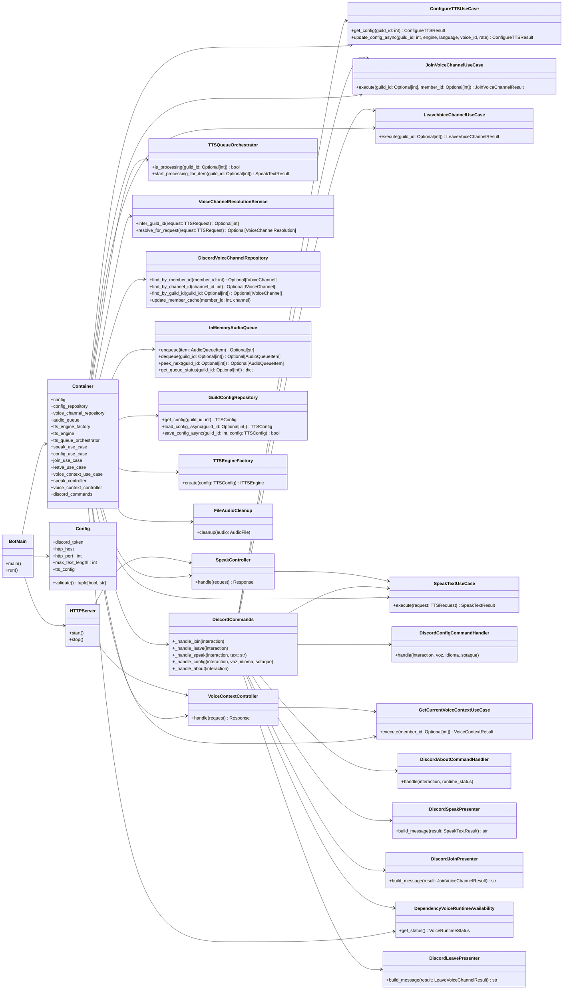

# Bot Runtime

## Notes

- `Container` is a composition root, so its many edges represent wiring rather than domain coupling.
- The important architectural handoff is from presentation into shared use cases.
