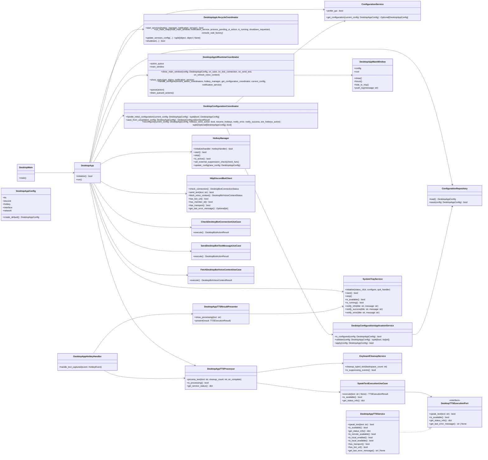

# Desktop Runtime

## Notes

- `DesktopApp` is intentionally larger because it owns startup and shutdown orchestration.
- `DesktopAppUIRuntimeCoordinator` owns queued UI actions and main-window lifecycle.
- Desktop bot communication now flows directly through explicit use cases plus `HttpDiscordBotClient`.
