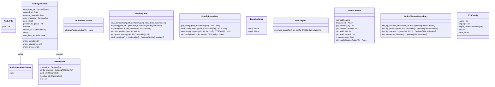

# Generated Core Diagram

Automatic class diagram for the innermost shared domain and port contracts in `src.core`.

```mermaid
classDiagram
  class AudioFile {
    path : str
  }
  class AudioQueueItem {
    completed_at : Optional[float]
    created_at : float
    duration_seconds : float
    error_message : Optional[str]
    item_id : str
    position_in_queue : int
    request
    started_at : Optional[float]
    status
    wait_time_seconds : float
    mark_completed()
    mark_failed(error: str)
    mark_processing()
  }
  class AudioQueueItemStatus {
    name
  }
  class IAudioFileCleanup {
    cleanup(audio: AudioFile)* None
  }
  class IAudioQueue {
    clear_completed(guild_id: Optional[int], older_than_seconds: int)*
    dequeue(guild_id: Optional[int])* Optional[AudioQueueItem]
    enqueue(item: AudioQueueItem)* Optional[str]
    get_item_position(item_id: str)* int
    get_queue_status(guild_id: Optional[int])* dict
    peek_next(guild_id: Optional[int])* Optional[AudioQueueItem]
  }
  class IConfigRepository {
    get_config(guild_id: Optional[int])* TTSConfig
    load_config_async(guild_id: Optional[int])* TTSConfig
    save_config_async(guild_id: int, config: TTSConfig)* bool
    set_config(guild_id: int, config: TTSConfig)* None
  }
  class IInputListener {
    start()* None
    stop()* None
  }
  class ITTSEngine {
    generate_audio(text: str, config: TTSConfig)* AudioFile
  }
  class IVoiceChannel {
    connect()* None
    disconnect()* None
    get_channel_id()* int
    get_channel_name()* str
    get_guild_id()* int
    get_guild_name()* str
    is_connected()* bool
    play_audio(audio: AudioFile)* None
  }
  class IVoiceChannelRepository {
    find_by_channel_id(channel_id: int)* Optional[IVoiceChannel]
    find_by_guild_id(guild_id: Optional[int])* Optional[IVoiceChannel]
    find_by_member_id(member_id: int)* Optional[IVoiceChannel]
    find_connected_channel()* Optional[IVoiceChannel]
  }
  class TTSConfig {
    engine : str
    language : str
    output_device : Optional[str]
    rate : int
    voice_id : str
  }
  class TTSRequest {
    channel_id : Optional[int]
    config_override : Optional['TTSConfig']
    guild_id : Optional[int]
    member_id : Optional[int]
    text : str
  }
  AudioQueueItem --> AudioQueueItemStatus : status
  AudioQueueItem --> TTSRequest : request
```
