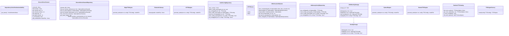

# Generated Infrastructure Diagram

Automatic class diagram for adapters and IO-facing implementations in `src.infrastructure`.

```mermaid
classDiagram
  class DependencyVoiceRuntimeAvailability {
    get_status() VoiceRuntimeStatus
  }
  class DiscordVoiceChannel {
    connect() None
    disconnect() None
    get_channel_id() int
    get_channel_name() str
    get_guild_id() int
    get_guild_name() str
    is_connected() bool
    play_audio(audio: AudioFile) None
  }
  class DiscordVoiceChannelRepository {
    cleanup_all() None
    find_by_channel_id(channel_id: int) Optional[IVoiceChannel]
    find_by_guild_id(guild_id: Optional[int]) Optional[IVoiceChannel]
    find_by_member_id(member_id: int) Optional[IVoiceChannel]
    find_connected_channel() Optional[IVoiceChannel]
    get_cache_stats() dict
    update_member_cache(member_id: int, channel: Optional[discord.VoiceChannel])
  }
  class EdgeTTSEngine {
    generate_audio(text: str, config: TTSConfig) AudioFile
  }
  class FileAudioCleanup {
    cleanup(audio: AudioFile) None
  }
  class GTTSEngine {
    generate_audio(text: str, config: TTSConfig) AudioFile
  }
  class GuildConfigRepository {
    clear_cache() None
    delete_config_async(guild_id: int) bool
    get_config(guild_id: int) TTSConfig
    load_config_async(guild_id: Optional[int]) TTSConfig
    load_from_storage(guild_id: int) TTSConfig
    save_config_async(guild_id: int, config: TTSConfig) bool
    set_config(guild_id: int, config: TTSConfig) None
  }
  class HTTPServer {
    start()
    stop()
  }
  class IConfigStorage {
    delete(guild_id: int)* bool
    load(guild_id: int)* Optional[TTSConfig]
    save(guild_id: int, config: TTSConfig)* bool
  }
  class InMemoryAudioQueue {
    clear_completed(guild_id: Optional[int], older_than_seconds: int)
    dequeue(guild_id: Optional[int]) Optional[AudioQueueItem]
    enqueue(item: AudioQueueItem) Optional[str]
    get_item_position(item_id: str) int
    get_queue_status(guild_id: Optional[int]) dict
    peek_next(guild_id: Optional[int]) Optional[AudioQueueItem]
  }
  class InMemoryConfigRepository {
    get_config(guild_id: Optional[int]) TTSConfig
    load_config_async(guild_id: Optional[int]) TTSConfig
    save_config_async(guild_id: int, config: TTSConfig) bool
    set_config(guild_id: int, config: TTSConfig) None
  }
  class JSONConfigStorage {
    storage_dir : Path
    delete(guild_id: int) bool
    load(guild_id: int) Optional[TTSConfig]
    load_sync(guild_id: int) Optional[TTSConfig]
    save(guild_id: int, config: TTSConfig) bool
  }
  class Pyttsx3Engine {
    generate_audio(text: str, config: TTSConfig) AudioFile
  }
  class RoutedTTSEngine {
    generate_audio(text: str, config: TTSConfig) AudioFile
  }
  class RuntimeTTSCatalog {
    find_voice_option() TTSVoiceOption | None
    get_voice_option(key: str) TTSVoiceOption | None
    is_voice_available() bool
    list_voice_options() list[TTSVoiceOption]
  }
  class TTSEngineFactory {
    create(config: TTSConfig) ITTSEngine
  }
  JSONConfigStorage --|> IConfigStorage
```
