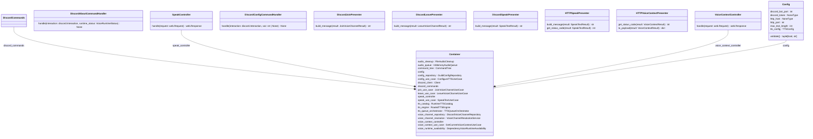

# Generated Presentation And Bot Runtime Diagram

Automatic class diagram for delivery entrypoints in `src.presentation` and the Discord bot composition root in `src.bot_runtime`.

```mermaid
classDiagram
  class Config {
    discord_bot_port : int
    discord_token : NoneType
    http_host : NoneType
    http_port : int
    max_text_length : int
    tts_config : TTSConfig
    validate() tuple[bool, str]
  }
  class Container {
    audio_cleanup : FileAudioCleanup
    audio_queue : InMemoryAudioQueue
    command_tree : CommandTree
    config
    config_repository : GuildConfigRepository
    config_use_case : ConfigureTTSUseCase
    discord_client : Client
    discord_commands
    join_use_case : JoinVoiceChannelUseCase
    leave_use_case : LeaveVoiceChannelUseCase
    speak_controller
    speak_use_case : SpeakTextUseCase
    tts_catalog : RuntimeTTSCatalog
    tts_engine : RoutedTTSEngine
    tts_queue_orchestrator : TTSQueueOrchestrator
    voice_channel_repository : DiscordVoiceChannelRepository
    voice_channel_resolution : VoiceChannelResolutionService
    voice_context_controller
    voice_context_use_case : GetCurrentVoiceContextUseCase
    voice_runtime_availability : DependencyVoiceRuntimeAvailability
  }
  class DiscordAboutCommandHandler {
    handle(interaction: discord.Interaction, runtime_status: VoiceRuntimeStatus) None
  }
  class DiscordCommands {
  }
  class DiscordConfigCommandHandler {
    handle(interaction: discord.Interaction, voz: str | None) None
  }
  class DiscordJoinPresenter {
    build_message(result: JoinVoiceChannelResult) str
  }
  class DiscordLeavePresenter {
    build_message(result: LeaveVoiceChannelResult) str
  }
  class DiscordSpeakPresenter {
    build_message(result: SpeakTextResult) str
  }
  class HTTPSpeakPresenter {
    build_message(result: SpeakTextResult) str
    get_status_code(result: SpeakTextResult) int
  }
  class HTTPVoiceContextPresenter {
    get_status_code(result: VoiceContextResult) int
    to_payload(result: VoiceContextResult) dict
  }
  class SpeakController {
    handle(request: web.Request) web.Response
  }
  class VoiceContextController {
    handle(request: web.Request) web.Response
  }
  DiscordCommands --* Container : discord_commands
  SpeakController --* Container : speak_controller
  VoiceContextController --* Container : voice_context_controller
  Config --o Container : config
```
