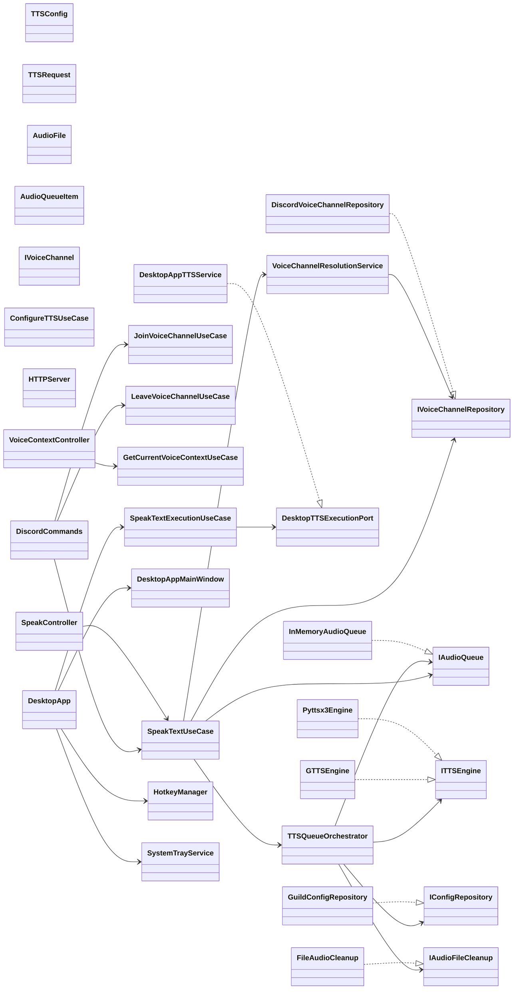

# Layer Overview

## Notes

- `core` owns shared entities and contracts.
- `application` coordinates reusable flows.
- `infrastructure` implements ports and external adapters.
- `presentation` delegates to application use cases.
- `desktop` is runtime-specific and should reuse shared logic rather than duplicating it.
