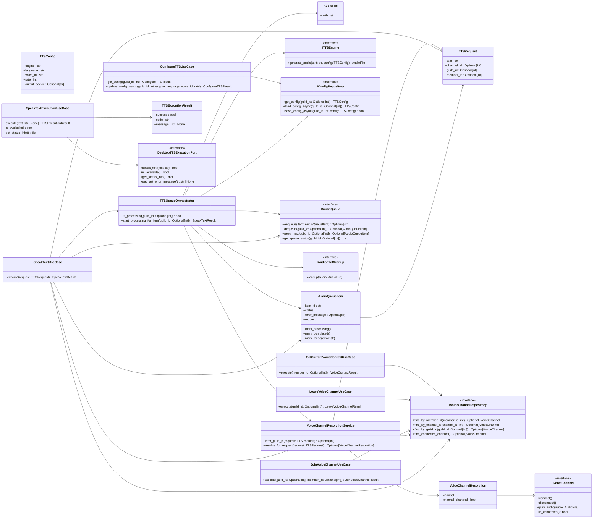

# Shared TTS Core

## Notes

- `SpeakTextUseCase` is the main shared bot TTS entrypoint.
- `TTSQueueOrchestrator` owns queued playback orchestration.
- `SpeakTextExecutionUseCase` is a shared desktop-oriented use case that depends on an explicit execution port.
