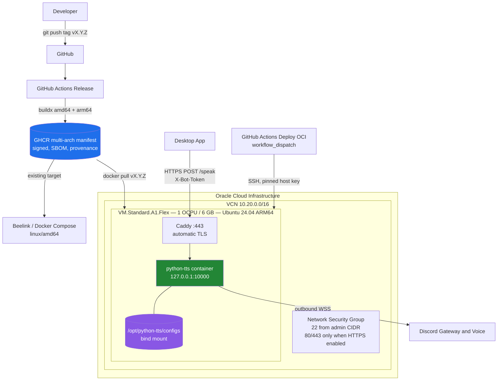

# Small Cloud VM Deploy

Run the Discord bot continuously on a single small cloud instance.

Two targets are supported and share everything above the machine itself: the
same released image, compose definition, reverse proxy, deploy script, and
rollback procedure. Pick one; you do not need both.

| | **OCI Ampere A1** (preferred) | **GCP e2-micro** (fallback) |
| --- | --- | --- |
| Architecture | arm64 | amd64 |
| CPU | 1 OCPU dedicated | 2 vCPU shared, ~0.25 baseline |
| Memory | 6 GB | **1 GB** |
| Disk | 50 GB | 30 GB standard |
| Regions | any with capacity | us-west1, us-central1, us-east1 only |
| Billing risk | Always Free, no card charge | **requires active billing account** |
| Availability | frequently out of capacity | reliably available |

**Prefer OCI.** Six times the memory and a dedicated core matter for this
workload: `ffmpeg` transcoding and Opus voice encoding are memory-hungry, and
1 GB leaves little headroom. On GCP, cloud-init provisions 2 GB of swap and the
compose file caps container memory so the kernel restarts the container rather
than killing `dockerd` or `sshd`.

**Use GCP when OCI Ampere A1 capacity is unavailable.** `Out of host capacity`
on `tofu apply` is common and unpredictable; the GCP path exists so a bot does
not wait on Oracle's inventory.

Two cost differences are worth knowing before choosing GCP: the Free Tier
requires an active billing account and bills automatically past its limits,
where OCI Always Free does not; and it includes only 1 GB/month of egress to
destinations outside North America. A voice bot produces continuous egress, so
confirm your own traffic against the current published limits.

This is an additional deployment shape. The Windows, Docker/Postgres, and
Render targets remain fully supported; see
[DEPLOYMENT_GUIDE.md](DEPLOYMENT_GUIDE.md).

The decision behind these targets is recorded in
[ADR 0008](../adr/0008-oci-ampere-a1-deployment-target.md).

## Architecture



What is deliberately **not** on this host: Postgres, Redis, Grafana, Prometheus,
Tempo, Alertmanager, and the OTel collector. The bot uses JSON config storage
and an in-memory queue so it fits comfortably in 1 OCPU and 6 GB.

## Prerequisites

Common to both targets:

| Requirement | Notes |
| --- | --- |
| OpenTofu | `>= 1.6.0` |
| SSH key pair | Public key goes to OpenTofu; the private key never does |
| Discord bot token | From the Discord Developer Portal |
| `BOT_SPEAK_TOKEN` | Generate with `openssl rand -hex 32` |
| Domain name | Optional. Required only for public HTTPS `/speak` |

For **OCI**:

| Requirement | Notes |
| --- | --- |
| OCI account | With a compartment you can create resources in |
| OCI API credentials | Run `oci setup config`, then upload the generated public key under Profile → User Settings → API Keys. Verify with `oci iam region-subscription list` |

For **GCP**:

| Requirement | Notes |
| --- | --- |
| GCP project | With the Compute Engine API enabled |
| Active billing account | Required even for Free Tier usage |
| Credentials | `gcloud auth application-default login`, or point `GOOGLE_APPLICATION_CREDENTIALS` at a service account key |

### Free-tier notes

Read this before applying.

Oracle's Always Free allocation is a property of **your tenancy**, not of this
repository, and Oracle's published limits and terms can change. Ampere A1
capacity is **tenancy-wide**: other instances in the same tenancy consume the
same allocation.

Verify your current Always Free allocation in the OCI console before running
`tofu apply`. This configuration:

- defaults to 1 OCPU and 6 GB, and rejects more than 4 OCPUs or 24 GB
- defaults to a 50 GB boot volume, and rejects more than 200 GB
- provisions no load balancer, database, or other managed service
- creates nothing that bills silently

These are guardrails against an accidentally large instance. They are not a
guarantee that your tenancy will not be charged. Confirm your own limits.

#### GCP Free Tier

The GCP Free Tier covers **one** e2-micro in `us-west1`, `us-central1`, or
`us-east1`, with 30 GB of standard persistent disk, per billing account. Unlike
OCI Always Free, it **requires an active billing account and charges
automatically** once a limit is passed.

This configuration:

- rejects any region outside the three eligible ones
- defaults to `e2-micro` and warns if another shape is selected
- caps the boot disk at the 30 GB allowance
- provisions no load balancer, Cloud NAT, database, or other managed service

Egress is the limit most likely to surprise a voice bot: the Free Tier includes
only 1 GB/month to destinations outside North America. Verify your project's
current terms and your own traffic before relying on it.

## Provisioning

### OCI

```bash
cd infra/environments/oci

cp terraform.tfvars.example terraform.tfvars
# Edit terraform.tfvars with your OCIDs, region, availability domain,
# SSH public key, and administrative CIDR.

tofu init
tofu fmt -check
tofu validate
tofu plan
tofu apply
```

`terraform.tfvars` is gitignored. Never commit it.

Record the outputs:

```bash
tofu output instance_public_ip
tofu output ssh_command
```

#### Required OCI variables

| Variable | Default | Notes |
| --- | --- | --- |
| `tenancy_ocid` | — | Required |
| `compartment_ocid` | — | Required |
| `region` | — | For example `sa-saopaulo-1` |
| `availability_domain` | — | For example `Uocm:SA-SAOPAULO-1-AD-1` |
| `ssh_public_key` | — | Public key material only |
| `ssh_allowed_cidrs` | — | Required. `0.0.0.0/0` is rejected |
| `instance_ocpus` | `1` | Max 4 |
| `instance_memory_gb` | `6` | Max 24 |
| `boot_volume_size_gb` | `50` | Max 200 |
| `instance_image_ocid` | `""` | Empty discovers the newest Ubuntu 24.04 ARM64 image |
| `enable_public_https` | `false` | Opens 80 and 443 |
| `public_hostname` | `""` | Required when HTTPS is enabled |
| `bot_http_allowed_cidrs` | `[]` | Opt-in direct access. `0.0.0.0/0` is rejected |

#### Image discovery

The module resolves the newest `Canonical Ubuntu 24.04` ARM64 platform image
through the `oci_core_images` data source, filtered by shape. If your tenancy or
region does not return a match, `tofu plan` fails with a clear message; set
`instance_image_ocid` explicitly to the OCID from the OCI console
(**Compute → Instances → Create → Change image**).

A platform image update alone will not recreate a running instance: the
instance ignores changes to the discovered image ID. To move to a newer image,
recreate the instance deliberately.

### GCP

```bash
cd infra/environments/gcp

cp terraform.tfvars.example terraform.tfvars
# Edit with your project ID, zone, SSH public key, and administrative CIDR.

gcloud auth application-default login

tofu init
tofu fmt -check
tofu validate
tofu plan
tofu apply
```

`terraform.tfvars` is gitignored. Never commit it.

Record the outputs:

```bash
tofu output instance_public_ip
tofu output ssh_command
```

The public IP is a reserved static address, so it survives instance recreation
and the DNS record does not need updating after a rebuild.

#### Required GCP variables

| Variable | Default | Notes |
| --- | --- | --- |
| `project_id` | — | Required |
| `region` | `us-central1` | Only the three Free Tier regions are accepted |
| `zone` | `us-central1-a` | Must be inside `region` |
| `ssh_public_key` | — | Public key material only |
| `ssh_allowed_cidrs` | — | Required. `0.0.0.0/0` is rejected |
| `machine_type` | `e2-micro` | Anything else is billed |
| `boot_disk_size_gb` | `30` | Free Tier allowance |
| `boot_disk_type` | `pd-standard` | Only this type is covered |
| `enable_public_https` | `false` | Opens 80 and 443 |
| `public_hostname` | `""` | Required when HTTPS is enabled |
| `bot_http_allowed_cidrs` | `[]` | Opt-in. `0.0.0.0/0` is rejected |

The boot image uses the `ubuntu-2404-lts-amd64` family, which tracks the newest
patched image. As on OCI, an image family update alone does not recreate a
running instance; recreate it deliberately to move to a newer image.

#### Memory on e2-micro

1 GB is the real constraint on this target. Two mitigations are applied
automatically:

- cloud-init provisions a 2 GB swap file with `vm.swappiness=10`, so swap acts
  as an OOM cushion rather than routine storage on a slow standard disk
- `docker-compose.vm.yml` sets `mem_limit` (default `768m`), so the kernel kills
  and restarts the bot container instead of picking `dockerd` or `sshd`

Raise the ceiling on the roomier OCI host by setting `BOT_MEMORY_LIMIT=2g` in
the runtime file.

If the bot is repeatedly OOM-killed under real load, that is the signal to move
to OCI, or to accept a billed `e2-small`.

## First deployment

Cloud-init installs Docker and prepares `/opt/python-tts`. Wait for it to
finish, then confirm:

```bash
ssh ubuntu@<PUBLIC_IP> 'cloud-init status --wait && docker compose version'
```

Create the runtime configuration locally from the example:

```bash
cp .env.vm.example .env.vm
# Fill in DISCORD_TOKEN, BOT_SPEAK_TOKEN, and BOT_IMAGE.
# Set PUBLIC_HOSTNAME only if you enabled HTTPS.
```

Add the host to `known_hosts` before uploading anything sensitive:

```bash
ssh-keyscan -H <PUBLIC_IP> >> ~/.ssh/known_hosts
```

Install the configuration and deployment assets:

```bash
./scripts/deploy/vm-bootstrap-env.sh --host <PUBLIC_IP> --env-file ./.env.vm
```

The script uploads `.env.vm` over SSH, installs it as
`/opt/python-tts/.env.runtime` with mode `0600`, and copies the compose file,
Caddyfile, and deploy script. It refuses to run if `DISCORD_TOKEN` or
`BOT_SPEAK_TOKEN` is empty or still a placeholder.

`.env.vm` is gitignored, but it holds real secrets. Store it in a password
manager and delete the local copy when you are done.

Deploy a released version:

```bash
ssh ubuntu@<PUBLIC_IP> '/opt/python-tts/scripts/vm-deploy.sh v1.2.3'
```

## DNS and HTTPS

Public `/speak` access is off by default. To enable it:

1. Set the variables and re-apply:

   ```hcl
   enable_public_https = true
   public_hostname     = "tts.example.com"
   ```

   ```bash
   tofu apply
   ```

   This opens `80/tcp` and `443/tcp`. Port 80 exists only for the ACME
   HTTP-01 challenge and the redirect to HTTPS.

2. Create one DNS record:

   ```text
   tts.example.com.  A  <OCI_PUBLIC_IP>
   ```

3. Set `PUBLIC_HOSTNAME` in `.env.vm`, re-run the bootstrap script, and
   redeploy. The deploy script starts the `https` profile automatically when
   `PUBLIC_HOSTNAME` is set.

Caddy requests a Let's Encrypt certificate on first start and renews it
automatically. Certificates persist in `/opt/python-tts/caddy/data`.

The Desktop App then points at:

```text
DISCORD_BOT_URL=https://tts.example.com
```

`BOT_SPEAK_TOKEN` still guards `/speak`, sent as the `X-Bot-Token` header. Caddy
adds transport security; it does not replace the token.

Only `/speak`, `/voice-context`, and `/health` are proxied. `/ready`,
`/observability`, `/version`, and `/about` are reachable from the host only —
they describe runtime internals and have no authentication of their own.

### Without a hostname

If you do not configure HTTPS, the bot port is not reachable from the internet.
Use an SSH tunnel for administration and testing:

```bash
ssh -L 10000:127.0.0.1:10000 ubuntu@<PUBLIC_IP>
# then, locally:
curl http://127.0.0.1:10000/health
```

A CIDR allowlist for direct access exists as an explicit opt-in
(`bot_http_allowed_cidrs`), but it carries plain HTTP and is not recommended.

## GitHub Actions

Create a `oci-production` environment in the repository, then add:

| Secret | Value |
| --- | --- |
| `OCI_DEPLOY_HOST` | Instance public IP or hostname |
| `OCI_DEPLOY_USER` | `ubuntu` |
| `OCI_DEPLOY_SSH_KEY` | Private key authorized on the instance |
| `OCI_DEPLOY_KNOWN_HOSTS` | Output of `ssh-keyscan -H <PUBLIC_IP>` |

Optional repository variable:

| Variable | Default |
| --- | --- |
| `OCI_APP_DIR` | `/opt/python-tts` |

`OCI_DEPLOY_KNOWN_HOSTS` pins the host key. Host key verification is never
disabled; a substituted host cannot receive a deployment. No application secret
is transmitted by the workflow — `DISCORD_TOKEN` and `BOT_SPEAK_TOKEN` live on
the instance.

## Deployment

Releasing and deploying are separate operations.

**Release** publishes the artifact:

```bash
git tag v1.2.3
git push origin v1.2.3
```

The `Release` workflow builds `linux/amd64` and `linux/arm64`, verifies the
published manifest contains both, scans, signs, and attests it.

**Deploy** promotes an existing release:

```text
Actions -> Deploy OCI -> Run workflow
  release_tag = v1.2.3
  dry_run     = false
```

The workflow validates the tag format, confirms the GHCR manifest contains
`linux/arm64`, connects over SSH with a pinned host key, runs the remote deploy
script, and reports the health response. Use `dry_run = true` to validate a tag
without touching the host.

Equivalently, from the instance:

```bash
ssh ubuntu@<PUBLIC_IP> '/opt/python-tts/scripts/vm-deploy.sh v1.2.3'
```

### Git tag vs registry tag

Always pass the git tag form, `v1.2.3`. The release workflow publishes through
`docker/metadata-action` with `type=semver,pattern={{version}}`, which strips
the leading `v`, so the tag in GHCR is `1.2.3`. The deploy script and the
deployment workflow accept `v1.2.3` and resolve it to the published tag for
you; `APP_VERSION` in the runtime file therefore records the registry form.

The deploy script:

1. validates the tag is semantic, rejecting `latest`
2. confirms the image exists and has a `linux/arm64` manifest entry
3. pulls the image
4. records the current version as `PREVIOUS_APP_VERSION`
5. restarts the container on the new tag
6. waits for `/health`, then `/ready`
7. fails with container logs if either check does not pass
8. prunes dangling layers only, keeping tagged images for fast rollback

Pushes never deploy automatically.

## Rollback

Rollback redeploys a known-good tag. It never rebuilds an image.

```text
current:  v1.3.0
previous: v1.2.4

deploy v1.3.0  ->  health/readiness fail  ->  rollback to v1.2.4
```

**On the instance**, using the recorded previous version:

```bash
ssh ubuntu@<PUBLIC_IP> '/opt/python-tts/scripts/vm-deploy.sh --rollback'
```

**Explicitly**, to any known-good tag:

```bash
ssh ubuntu@<PUBLIC_IP> '/opt/python-tts/scripts/vm-deploy.sh v1.2.4'
```

**Through GitHub Actions**, which is the same operation:

```text
Actions -> Deploy OCI -> Run workflow
  release_tag = v1.2.4
```

The repository's `Rollback Bot Image` workflow also targets this host, since its
inputs are deployment-shape agnostic. Use these inputs:

```text
runner       = ["ubuntu-latest"]   # only if the runner can reach the host
bot_image    = ghcr.io/erikalira/tts-hotkey-windows-bot
app_version  = v1.2.4
env_file     = /opt/python-tts/.env.runtime
compose_file = /opt/python-tts/compose.yaml
health_url   = http://127.0.0.1:10000/health
ready_url    = http://127.0.0.1:10000/ready
```

That workflow expects to run **on** the target host, so it needs a self-hosted
runner there. For this single-node target, `Deploy OCI` with an earlier tag is
the simpler path and is the documented default.

Because the previous image is not pruned, rollback does not re-download it.

## Logs

```bash
ssh ubuntu@<PUBLIC_IP>
cd /opt/python-tts

docker compose --env-file .env.runtime -f compose.yaml logs -f bot
docker compose --env-file .env.runtime -f compose.yaml logs --tail 100 bot
docker compose --env-file .env.runtime -f compose.yaml ps
```

Caddy logs, when the HTTPS profile is running:

```bash
docker compose --env-file .env.runtime -f compose.yaml --profile https logs caddy
```

Log rotation is configured in two places so an always-on bot cannot fill the
disk: the Docker daemon caps every container at 3 files of 10 MB, and the
compose services set the same limits explicitly.

## Health

From the instance:

```bash
curl http://127.0.0.1:10000/health   # {"status": "healthy"}
curl http://127.0.0.1:10000/ready    # {"status": "ready", "dependencies": [...]}
```

`/ready` returns `503` until dependencies are satisfied, which is what the
deploy script waits on.

Through an SSH tunnel, or over HTTPS when enabled:

```bash
curl https://tts.example.com/health
```

Confirm the Discord side by checking that the bot appears online in your server
and responds to a command.

## Reboot recovery

The bot returns automatically after a reboot, a Docker restart, or a crash:

- the container uses `restart: unless-stopped`
- Docker is enabled at boot by cloud-init (`systemctl enable --now docker`)
- the Docker daemon runs with `live-restore`

Verify deliberately:

```bash
ssh ubuntu@<PUBLIC_IP> 'sudo reboot'
# wait about a minute
ssh ubuntu@<PUBLIC_IP> 'docker ps --format "{{.Names}}\t{{.Status}}"'
ssh ubuntu@<PUBLIC_IP> 'curl -s http://127.0.0.1:10000/health'
```

Both the container and the health endpoint should come back without manual
intervention. Confirm Docker is enabled at boot:

```bash
ssh ubuntu@<PUBLIC_IP> 'systemctl is-enabled docker'
```

## Disaster recovery

This host holds very little state, which is the point.

| What | Where | Backup |
| --- | --- | --- |
| Runtime secrets | `/opt/python-tts/.env.runtime` | Password manager or secret store. **Never** a public backup |
| Bot configuration | `/opt/python-tts/configs/` | Regular copy; this is the only stateful data |
| Deployed version | `APP_VERSION` in `.env.runtime` | Also in the GitHub release history |
| Certificates | `/opt/python-tts/caddy/data` | Not required; Caddy re-issues them |

Back up the configuration directory:

```bash
ssh ubuntu@<PUBLIC_IP> 'sudo tar czf - -C /opt/python-tts configs' > tts-configs-backup.tar.gz
```

Full recovery on a new instance:

```bash
tofu apply                                    # provision
./scripts/deploy/vm-bootstrap-env.sh ...     # reinstall secrets
scp tts-configs-backup.tar.gz ubuntu@<NEW_IP>:/tmp/
ssh ubuntu@<NEW_IP> 'sudo tar xzf /tmp/tts-configs-backup.tar.gz -C /opt/python-tts && sudo chown -R 1000:1000 /opt/python-tts/configs'
ssh ubuntu@<NEW_IP> '/opt/python-tts/scripts/vm-deploy.sh v1.2.3'
```

There is no database to restore on this target. If you need durable Postgres
persistence, use [DOCKER_POSTGRES_DEPLOY.md](DOCKER_POSTGRES_DEPLOY.md) instead
and see [BACKUP_AND_RESTORE_DATABASE.md](BACKUP_AND_RESTORE_DATABASE.md).

## Destroy

```bash
cd infra/environments/oci   # or infra/environments/gcp
tofu destroy
```

Run this from the environment directory. From the repository root there is no
state, so OpenTofu reports "No changes" and destroys nothing.

This permanently deletes:

- the instance and its **boot volume**, including `/opt/python-tts/configs`
  (all bot guild configuration) and `/opt/python-tts/.env.runtime`
- the network: on OCI the VCN, subnet, internet gateway, route table, and
  network security group; on GCP the VPC, subnet, and firewall rules
- the public IP. On OCI a new instance gets a new address, so the DNS record
  must be updated; on GCP the reserved static address is released only by
  `destroy`, so keeping the environment means keeping the address

Back up `configs/` and confirm you still hold `DISCORD_TOKEN` and
`BOT_SPEAK_TOKEN` before destroying. Published GHCR images are not affected.

## Related documents

- [DEPLOYMENT_GUIDE.md](DEPLOYMENT_GUIDE.md) — choose a deployment shape
- [ENVIRONMENTS.md](ENVIRONMENTS.md) — environment variable reference
- [STAGING_AND_ROLLBACK.md](STAGING_AND_ROLLBACK.md) — release promotion and rollback concepts
- [ADR 0008](../adr/0008-oci-ampere-a1-deployment-target.md) — why this target exists
- [../security/THREAT_MODEL.md](../security/THREAT_MODEL.md) — runtime threat model
