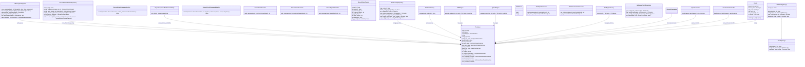

# Generated Bot Runtime Diagram

Automatic class diagram for bot runtime, presentation, and infrastructure modules.

```mermaid
classDiagram
  class Config {
    discord_bot_port : int
    discord_token : NoneType
    http_host : NoneType
    http_port : int
    max_text_length : int
    tts_config : TTSConfig
    validate() tuple[bool, str]
  }
  class Container {
    audio_cleanup
    audio_queue
    command_tree : CommandTree
    config
    config_repository
    config_use_case : ConfigureTTSUseCase
    discord_client : Client
    discord_commands
    join_use_case : JoinVoiceChannelUseCase
    leave_use_case : LeaveVoiceChannelUseCase
    speak_controller
    speak_use_case : SpeakTextUseCase
    tts_engine
    tts_engine_factory
    tts_queue_orchestrator : TTSQueueOrchestrator
    voice_channel_repository
    voice_channel_resolution : VoiceChannelResolutionService
    voice_context_controller
    voice_context_use_case : GetCurrentVoiceContextUseCase
    voice_runtime_availability
  }
  class DependencyVoiceRuntimeAvailability {
    get_status() VoiceRuntimeStatus
  }
  class DiscordAboutCommandHandler {
    handle(interaction: discord.Interaction, runtime_status: VoiceRuntimeStatus) None
  }
  class DiscordCommands {
  }
  class DiscordConfigCommandHandler {
    handle(interaction: discord.Interaction, voz: str | None, idioma: str | None, sotaque: str | None) None
  }
  class DiscordJoinPresenter {
    build_message(result: JoinVoiceChannelResult) str
  }
  class DiscordLeavePresenter {
    build_message(result: LeaveVoiceChannelResult) str
  }
  class DiscordSpeakPresenter {
    build_message(result: SpeakTextResult) str
  }
  class DiscordVoiceChannel {
    connect() None
    disconnect() None
    get_channel_id() int
    get_channel_name() str
    get_guild_id() int
    get_guild_name() str
    is_connected() bool
    play_audio(audio: AudioFile) None
  }
  class DiscordVoiceChannelRepository {
    cleanup_all() None
    find_by_channel_id(channel_id: int) Optional[IVoiceChannel]
    find_by_guild_id(guild_id: Optional[int]) Optional[IVoiceChannel]
    find_by_member_id(member_id: int) Optional[IVoiceChannel]
    find_connected_channel() Optional[IVoiceChannel]
    get_cache_stats() dict
    update_member_cache(member_id: int, channel: Optional[discord.VoiceChannel])
  }
  class FileAudioCleanup {
    cleanup(audio: AudioFile) None
  }
  class GTTSEngine {
    generate_audio(text: str, config: TTSConfig) AudioFile
  }
  class GuildConfigRepository {
    clear_cache() None
    delete_config_async(guild_id: int) bool
    get_config(guild_id: int) TTSConfig
    load_config_async(guild_id: Optional[int]) TTSConfig
    load_from_storage(guild_id: int) TTSConfig
    save_config_async(guild_id: int, config: TTSConfig) bool
    set_config(guild_id: int, config: TTSConfig) None
  }
  class HTTPServer {
    start()
    stop()
  }
  class HTTPSpeakPresenter {
    build_message(result: SpeakTextResult) str
    get_status_code(result: SpeakTextResult) int
  }
  class HTTPVoiceContextPresenter {
    get_status_code(result: VoiceContextResult) int
    to_payload(result: VoiceContextResult) dict
  }
  class IConfigStorage {
    delete(guild_id: int)* bool
    load(guild_id: int)* Optional[TTSConfig]
    save(guild_id: int, config: TTSConfig)* bool
  }
  class InMemoryAudioQueue {
    clear_completed(guild_id: Optional[int], older_than_seconds: int)
    dequeue(guild_id: Optional[int]) Optional[AudioQueueItem]
    enqueue(item: AudioQueueItem) Optional[str]
    get_item_position(item_id: str) int
    get_queue_status(guild_id: Optional[int]) dict
    peek_next(guild_id: Optional[int]) Optional[AudioQueueItem]
  }
  class InMemoryConfigRepository {
    get_config(guild_id: Optional[int]) TTSConfig
    load_config_async(guild_id: Optional[int]) TTSConfig
    save_config_async(guild_id: int, config: TTSConfig) bool
    set_config(guild_id: int, config: TTSConfig) None
  }
  class JSONConfigStorage {
    storage_dir : Path
    delete(guild_id: int) bool
    load(guild_id: int) Optional[TTSConfig]
    load_sync(guild_id: int) Optional[TTSConfig]
    save(guild_id: int, config: TTSConfig) bool
  }
  class Pyttsx3Engine {
    generate_audio(text: str, config: TTSConfig) AudioFile
  }
  class SpeakController {
    handle(request: web.Request) web.Response
  }
  class TTSEngineFactory {
    create(config: TTSConfig) ITTSEngine
  }
  class VoiceContextController {
    handle(request: web.Request) web.Response
  }
  JSONConfigStorage --|> IConfigStorage
  InMemoryAudioQueue --* Container : audio_queue
  DiscordVoiceChannelRepository --* Container : voice_channel_repository
  DependencyVoiceRuntimeAvailability --* Container : voice_runtime_availability
  GuildConfigRepository --* Container : config_repository
  FileAudioCleanup --* Container : audio_cleanup
  GTTSEngine --* Container : tts_engine
  Pyttsx3Engine --* Container : tts_engine
  TTSEngineFactory --* Container : tts_engine_factory
  DiscordCommands --* Container : discord_commands
  SpeakController --* Container : speak_controller
  VoiceContextController --* Container : voice_context_controller
  Config --o Container : config
```
