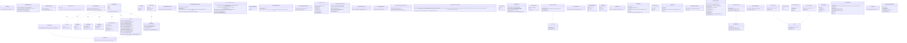

# Generated Desktop Runtime Diagram

Automatic class diagram for Desktop App runtime, GUI, services, and config modules.

```mermaid
classDiagram
  class AudioDevice {
    set_output_device(device_name: str) bool
  }
  class ConfigDialogsPresenter {
    build_console_initial_setup_result() InitialSetupResult
    build_initial_setup_result() tuple[InitialSetupResult, DialogFeedback]
    build_skip_discord_result() InitialSetupResult
    format_validation_errors(errors: list[str]) str
    validate_initial_setup() DialogFeedback | None
  }
  class ConfigInterface {
    show_config(config: DesktopAppConfig)* Optional[DesktopAppConfig]
  }
  class ConfigurationRepository {
    load() DesktopAppConfig
    save(config: DesktopAppConfig) bool
  }
  class ConfigurationService {
    prefer_gui : bool
    get_configuration(current_config: DesktopAppConfig) Optional[DesktopAppConfig]
  }
  class ConfigurationValidator {
    is_configured(config: DesktopAppConfig) bool
    validate(config: DesktopAppConfig) tuple[bool, list[str]]
  }
  class ConsoleConfig {
    show_config(config: DesktopAppConfig) Optional[DesktopAppConfig]
  }
  class ConsoleNotificationService {
    is_available() bool
    show_error(title: str, message: str) None
    show_info(title: str, message: str) None
    show_success(title: str, message: str) None
  }
  class DesktopApp {
    initialize() bool
    run() None
  }
  class DesktopAppConfig {
    discord
    hotkey
    interface
    network
    tts : TTSConfig
    create_default() 'DesktopAppConfig'
  }
  class DesktopAppHotkeyHandler {
    handle_text_captured(event: HotkeyEvent) None
  }
  class DesktopAppLifecycleCoordinator {
    process_pending_ui_action() None
    run_main_loop() None
    shutdown() bool
    start_services(hotkey_manager: HotkeyManagerLike, notification_service: NotificationServiceLike) bool
    update_services_config() tuple[object, NotificationServiceLike | None]
  }
  class DesktopAppMainWindow {
    config : NoneType
    root : Optional[object], Tk
    focus() None
    hide_to_tray() None
    push_log(message: str) None
    show() None
  }
  class DesktopAppMainWindowPresenter {
    build_connection_result(result: DesktopBotActionResult, default_message: str) MainWindowMessage
    build_invalid_value_message(action_name: str, exc: ValueError) MainWindowMessage
    build_local_config_status(config: DesktopAppConfig) MainWindowMessage
    build_status(message: str, success: bool) MainWindowMessage
    initial_connection() MainWindowMessage
    initial_status() MainWindowMessage
    initial_voice_context() MainWindowMessage
  }
  class DesktopAppStatusBuilder {
    build() dict
  }
  class DesktopAppTTSProcessor {
    get_service_status() dict
    is_processing() bool
    process_text(text: str, cleanup_count: int, on_complete: Optional[Callable[[TTSExecutionResult], None]]) None
  }
  class DesktopAppTTSResultPresenter {
    present(result: TTSExecutionResult) None
    show_processing(text: str) None
  }
  class DesktopAppTTSService {
    get_last_error_message() str | None
    get_status_info() dict
    has_bot_url() bool
    has_transport() bool
    is_available() bool
    is_local_available() bool
    is_local_enabled() bool
    is_remote_available() bool
    speak_text(text: str) bool
  }
  class DesktopAppUIRuntimeCoordinator {
    action_queue : 'queue.Queue[Callable[[], None]]'
    main_window : Optional[DesktopAppMainWindow]
    drain_queued_actions() None
    handle_configure() tuple[Optional[object], bool]
    queue(action: Callable[[], None]) None
    show_main_window() None
    show_status() None
  }
  class DesktopConfigEnvironment {
    update_from_config(config: DesktopAppConfig)* None
  }
  class DesktopConfigRepository {
    save(config: DesktopAppConfig)* bool
  }
  class DesktopConfigurationApplicationService {
    apply(config: DesktopAppConfig) bool
    is_configured(config: DesktopAppConfig) bool
    validate(config: DesktopAppConfig) tuple[bool, list[str]]
  }
  class DesktopConfigurationCoordinator {
    handle_initial_configuration(current_config: DesktopAppConfig) tuple[bool, DesktopAppConfig]
    reconfigure(current_config: DesktopAppConfig, hotkeys_were_active: bool, resume_hotkeys: Callable[[], None], notify_error: Optional[Callable[[str, str], None]], notify_success: Optional[Callable[[str, str], None]], are_hotkeys_active: Optional[Callable[[], bool]]) tuple[Optional[DesktopAppConfig], bool]
    save_from_ui(updated_config: DesktopAppConfig) DesktopConfigurationSaveResult
  }
  class DialogFeedback {
    message : str
    title : str
  }
  class DiscordBotClient {
    build_request(text: str)* DiscordSpeakRequest
    check_connection()* DesktopBotConnectionStatus
    fetch_voice_context()* DesktopBotVoiceContextStatus
    get_last_error_message()* Optional[str]
    is_available()* bool
    send_speak_request(request: DiscordSpeakRequest)* bool
  }
  class DiscordConfig {
    bot_url : str
    member_id : Optional[str]
  }
  class DiscordSpeakRequest {
    member_id : Optional[str]
    text : str
    to_payload() dict
  }
  class DiscordTTSService {
    get_last_error_message() str | None
    is_available() bool
    speak(text: str) bool
  }
  class EnvironmentUpdater {
    update_from_config(config: DesktopAppConfig) None
  }
  class GUIConfig {
    bot_url_var : Optional[object], StringVar
    config : NoneType, Optional[DesktopAppConfig]
    console_logs_var : BooleanVar, NoneType
    engine_var : Optional[object], StringVar
    language_var : Optional[object], StringVar
    local_tts_enabled_var : BooleanVar, NoneType
    member_id_var : Optional[object], StringVar
    rate_var : Optional[object], StringVar
    result : NoneType, Optional[DesktopAppConfig]
    root : NoneType, Optional[object], Tk
    show_notifications_var : BooleanVar, NoneType
    trigger_close_var : Optional[object], StringVar
    trigger_open_var : Optional[object], StringVar
    voice_id_var : Optional[object], StringVar
    show_config(config: DesktopAppConfig) Optional[DesktopAppConfig]
  }
  class HotkeyCaptureResult {
    backspace_count : int
    text : str
    trigger_close : str
    trigger_open : str
  }
  class HotkeyConfig {
    keys : str
    trigger_close : str
    trigger_open : str
  }
  class HotkeyEvent {
    character_count : int
    text : str
    trigger_close : str
    trigger_open : str
  }
  class HotkeyHandler {
    handle_text_captured(event: HotkeyEvent) None
  }
  class HotkeyManager {
    get_status() dict
    initialize(handler: HotkeyHandler) bool
    is_active() bool
    set_external_suppression_check(check_func: Callable[[], bool]) None
    start() bool
    stop() None
    update_config(new_config: DesktopAppConfig) None
  }
  class HotkeyManagerLike {
    is_active() bool
    start() bool
    stop() None
  }
  class HotkeyService {
    get_status() dict
    is_active() bool
    set_external_suppression_check(check_func: Callable[[], bool]) None
    start() bool
    stop() None
  }
  class HotkeyTextCaptureSession {
    process_key(key: str) HotkeyCaptureResult | None
    reset() None
  }
  class HttpDiscordBotClient {
    build_request(text: str) DiscordSpeakRequest
    check_connection() DesktopBotConnectionStatus
    fetch_voice_context() DesktopBotVoiceContextStatus
    get_health_url() str
    get_last_error_message() Optional[str]
    get_speak_url() str
    get_voice_context_url() str
    has_bot_url() bool
    has_member_id() bool
    has_transport() bool
    is_available() bool
    send_speak_request(request: DiscordSpeakRequest) bool
    send_text(text: str) bool
  }
  class InitialSetupGUI {
    bot_url_var : Optional[object], StringVar
    member_id_var : Optional[object], StringVar
    result : Optional[InitialSetupResult]
    root : Optional[object], Tk
    show_initial_setup() Optional[InitialSetupResult]
  }
  class InitialSetupResult {
    bot_url : str
    member_id : str | None
    skip_discord : bool
  }
  class InterfaceConfig {
    console_logs : bool
    local_tts_enabled : bool
    show_notifications : bool
  }
  class KeyboardCleanupService {
    cleanup_typed_text(backspace_count: int) None
    is_suppressing_events() bool
  }
  class KeyboardMonitor {
    is_monitoring()* bool
    start_monitoring()* bool
    stop_monitoring()* None
  }
  class LocalPyTTSX3Engine {
    get_last_error_message() str | None
    is_available() bool
    speak(text: str) bool
  }
  class MainWindowMessage {
    color : str
    text : str
  }
  class NetworkConfig {
    max_text_length : int
    request_timeout : int
    user_agent : str
  }
  class NotificationService {
    is_available()* bool
    show_error(title: str, message: str)* None
    show_info(title: str, message: str)* None
    show_success(title: str, message: str)* None
  }
  class NotificationServiceLike {
    is_available() bool
    is_running() bool
    start() bool
    stop() None
  }
  class StandardKeyboardMonitor {
    is_monitoring() bool
    set_external_suppression_check(check_func: Callable[[], bool]) None
    start_monitoring() bool
    stop_monitoring() None
  }
  class SystemTrayIcon {
    hide()* None
    is_available()* bool
    is_running()* bool
    set_tooltip(tooltip: str)* None
    show()* None
  }
  class SystemTrayService {
    get_status() dict
    initialize(status_click: Optional[Callable], configure: Optional[Callable], quit_handler: Optional[Callable]) None
    is_available() bool
    is_running() bool
    notify_error(title: str, message: str) None
    notify_info(title: str, message: str) None
    notify_success(title: str, message: str) None
    run_tray() None
    start() bool
    stop() None
  }
  class TTSEngine {
    get_last_error_message()* str | None
    is_available()* bool
    speak(text: str)* bool
  }
  class UILogHandler {
    emit(record: logging.LogRecord) None
  }
  class _DesktopAppTTSStatusGateway {
    has_bot_url() bool
    has_transport() bool
    is_local_available() bool
    is_local_dependency_installed() bool
    is_local_enabled() bool
    is_remote_available() bool
  }
  ConsoleConfig --|> ConfigInterface
  GUIConfig --|> ConfigInterface
  StandardKeyboardMonitor --|> KeyboardMonitor
  ConsoleNotificationService --|> NotificationService
  DiscordTTSService --|> TTSEngine
  LocalPyTTSX3Engine --|> TTSEngine
  DesktopAppConfig --> DiscordConfig : discord
  DesktopAppConfig --> HotkeyConfig : hotkey
  DesktopAppConfig --> InterfaceConfig : interface
  DesktopAppConfig --> NetworkConfig : network
  InitialSetupResult --* InitialSetupGUI : result
  DesktopAppConfig --o DesktopAppMainWindow : config
  DesktopAppConfig --o GUIConfig : config
  DesktopAppConfig --o GUIConfig : result
```
