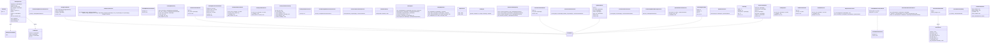

# Generated Shared Diagram

Automatic class diagram for shared core and application modules.

```mermaid
classDiagram
  class AudioFile {
    path : str
  }
  class AudioQueueItem {
    completed_at : Optional[float]
    created_at : float
    duration_seconds : float
    error_message : Optional[str]
    item_id : str
    position_in_queue : int
    request
    started_at : Optional[float]
    status
    wait_time_seconds : float
    mark_completed()
    mark_failed(error: str)
    mark_processing()
  }
  class AudioQueueItemStatus {
    name
  }
  class CheckDesktopBotConnectionUseCase {
    execute() DesktopBotActionResult
  }
  class ConfigureTTSResult {
    config : Optional[TTSConfigurationData]
    guild_id : Optional[int]
    message : Optional[str]
    success : bool
  }
  class ConfigureTTSUseCase {
    get_config(guild_id: int) ConfigureTTSResult
    update_config_async(guild_id: int, engine: Optional[str], language: Optional[str], voice_id: Optional[str], rate: Optional[int]) ConfigureTTSResult
  }
  class DesktopBotActionResult {
    message : str
    success : bool
  }
  class DesktopBotConnectionStatus {
    message : str
    success : bool
  }
  class DesktopBotGateway {
    check_connection()* DesktopBotConnectionStatus
    fetch_voice_context()* DesktopBotVoiceContextStatus
    get_last_error_message()* Optional[str]
    has_bot_url()* bool
    has_member_id()* bool
    send_text(text: str)* bool
  }
  class DesktopBotVoiceContextResult {
    channel_name : str | None
    guild_name : str | None
  }
  class DesktopBotVoiceContextStatus {
    channel_id : int | None
    channel_name : str | None
    guild_id : int | None
    guild_name : str | None
    message : str
    success : bool
  }
  class DesktopTTSExecutionPort {
    get_last_error_message()* str | None
    get_status_info()* dict[str, Any]
    is_available()* bool
    speak_text(text: str)* bool
  }
  class DesktopTTSFlowService {
    get_last_error_message() str | None
    is_available() bool
    speak_text(text: str | None) bool
  }
  class DesktopTTSStatusGateway {
    has_bot_url()* bool
    has_transport()* bool
    is_local_available()* bool
    is_local_dependency_installed()* bool
    is_local_enabled()* bool
    is_remote_available()* bool
  }
  class DesktopTTSStatusUseCase {
    execute() dict
  }
  class FetchDesktopBotVoiceContextUseCase {
    execute() DesktopBotVoiceContextResult
  }
  class GetCurrentVoiceContextUseCase {
    execute(member_id: Optional[int]) VoiceContextResult
  }
  class IAudioFileCleanup {
    cleanup(audio: AudioFile)* None
  }
  class IAudioQueue {
    clear_completed(guild_id: Optional[int], older_than_seconds: int)*
    dequeue(guild_id: Optional[int])* Optional[AudioQueueItem]
    enqueue(item: AudioQueueItem)* Optional[str]
    get_item_position(item_id: str)* int
    get_queue_status(guild_id: Optional[int])* dict
    peek_next(guild_id: Optional[int])* Optional[AudioQueueItem]
  }
  class IConfigRepository {
    get_config(guild_id: Optional[int])* TTSConfig
    load_config_async(guild_id: Optional[int])* TTSConfig
    save_config_async(guild_id: int, config: TTSConfig)* bool
    set_config(guild_id: int, config: TTSConfig)* None
  }
  class IInputListener {
    start()* None
    stop()* None
  }
  class ITTSEngine {
    generate_audio(text: str, config: TTSConfig)* AudioFile
  }
  class IVoiceChannel {
    connect()* None
    disconnect()* None
    get_channel_id()* int
    get_channel_name()* str
    get_guild_id()* int
    get_guild_name()* str
    is_connected()* bool
    play_audio(audio: AudioFile)* None
  }
  class IVoiceChannelRepository {
    find_by_channel_id(channel_id: int)* Optional[IVoiceChannel]
    find_by_guild_id(guild_id: Optional[int])* Optional[IVoiceChannel]
    find_by_member_id(member_id: int)* Optional[IVoiceChannel]
    find_connected_channel()* Optional[IVoiceChannel]
  }
  class JoinVoiceChannelResult {
    code : str
    error_detail : Optional[str]
    success : bool
  }
  class JoinVoiceChannelUseCase {
    execute(guild_id: Optional[int], member_id: Optional[int]) JoinVoiceChannelResult
  }
  class LeaveVoiceChannelResult {
    code : str
    error_detail : Optional[str]
    success : bool
  }
  class LeaveVoiceChannelUseCase {
    execute(guild_id: Optional[int]) LeaveVoiceChannelResult
  }
  class ResultBase {
  }
  class SendDesktopBotTestMessageUseCase {
    execute() DesktopBotActionResult
  }
  class SpeakTextExecutionUseCase {
    execute(text: str | None) TTSExecutionResult
    get_status_info() dict
    is_available() bool
  }
  class SpeakTextResult {
    code : str
    error_detail : Optional[str]
    item_id : Optional[str]
    position : Optional[int]
    queue_size : Optional[int]
    queued : bool
    success : bool
  }
  class SpeakTextUseCase {
    execute(request: TTSRequest) SpeakTextResult
  }
  class TTSConfig {
    engine : str
    language : str
    output_device : Optional[str]
    rate : int
    voice_id : str
  }
  class TTSConfigurationData {
    engine : str
    language : str
    rate : int
    voice_id : str
  }
  class TTSEnginePort {
    get_last_error_message()* str | None
    is_available()* bool
    speak(text: str)* bool
  }
  class TTSExecutionResult {
    code : str
    message : str | None
    success : bool
  }
  class TTSFallbackChain {
    get_last_error_message() str | None
    is_available() bool
    speak(text: str) bool
  }
  class TTSQueueOrchestrator {
    is_processing(guild_id: Optional[int]) bool
    start_processing_for_item(guild_id: Optional[int]) SpeakTextResult
  }
  class TTSRequest {
    channel_id : Optional[int]
    guild_id : Optional[int]
    member_id : Optional[int]
    text : str
  }
  class VoiceChannelResolution {
    channel
    channel_changed : bool
  }
  class VoiceChannelResolutionService {
    infer_guild_id(request: TTSRequest) Optional[int]
    is_member_in_channel(member_id: int, channel: IVoiceChannel) bool
    resolve_for_request(request: TTSRequest) Optional[VoiceChannelResolution]
  }
  class VoiceContextResult {
    channel_id : Optional[int]
    channel_name : Optional[str]
    code : str
    guild_id : Optional[int]
    guild_name : Optional[str]
    member_id : Optional[int]
    success : bool
  }
  class VoiceRuntimeAvailability {
    get_status()* VoiceRuntimeStatus
  }
  class VoiceRuntimeStatus {
    davey_installed : bool
    ffmpeg_available : bool
    is_available : bool
    pynacl_installed : bool
    missing_dependencies() list[str]
  }
  DesktopBotVoiceContextResult --|> DesktopBotActionResult
  ConfigureTTSResult --|> ResultBase
  JoinVoiceChannelResult --|> ResultBase
  LeaveVoiceChannelResult --|> ResultBase
  SpeakTextResult --|> ResultBase
  TTSConfigurationData --|> ResultBase
  VoiceContextResult --|> ResultBase
  AudioQueueItem --> AudioQueueItemStatus : status
  AudioQueueItem --> TTSRequest : request
  VoiceChannelResolution --> IVoiceChannel : channel
```
